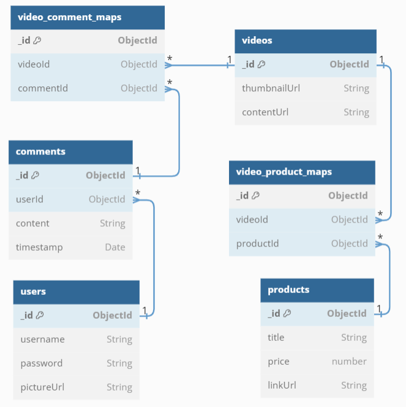

# gigih-play-backend

## Database Structure
I'm using MongoDB for the DBMS. I'm implementing the database schema with BCNF/3.5 normal form technique for storage efficiency and source code easy compatibility.  

## Folder Structure 
I'm using Clean Architecture for the folder structure. The Folder structure is divided into onion-like layers, which are:
- **Model Layer**: This layer contains the data model of the application. It is the innermost layer of the application.
- **Repository Layer**: This layer contains the database access logic. It is the outermost layer of the application.
- **Use Case Layer**: This layer contains the use case logic. It is the layer between the model layer and the repository layer.
- **Controller Layer**: This layer contains the API endpoint logic. It is the outermost layer of the application.

## API Structure
### Models

#### Result
| Field    | Type   |
|----------|--------|
| status   | string |
| message  | string |
| data     | any    |

#### User
| Field       | Type   |
|-------------|--------|
| _id         | string |
| username    | string |
| picture_url | string | 

#### Product
| Field      | Type   |
|------------|--------| 
| _id        | string |
| title      | string |
| price      | number |
| link_url   | string | 

#### Comment
| Field     | Type   |
|-----------|--------|
| _id       | string | 
| user_id   | string |
| content   | string |
| timestamp | string |

#### Video
| Field         | Type   |
|---------------|--------|
| _id           | string |
| thumbnail_url | string |
| content_url   | string |

#### VideoCommentMap
| Field       | Type   |
|-------------|--------|
| _id         | string |
| video_id    | string |
| comment_id  | string |

#### VideoProductMap
| Field       | Type   |
|-------------|--------|
| _id         | string |
| video_id    | string |
| product_id  | string |

#### SubmitCommentRequest
| Field    | Type   |
|----------|--------|
| video_id | string |
| username | string |
| content  | string |

#### JoinRoomRequest
| Field        | Type    |
|--------------|---------|
| videoId      | string  |
| isAggregated | boolean |

#### LoginByUsernameAndPasswordRequest
| Field     | Type   |
|-----------|--------|
| username  | string |
| password  | string |

#### RegisterByUsernameAndPasswordRequest
| Field     | Type   |
|-----------|--------|
| username  | string |
| password  | string |
 
### REST Endpoints
#### User
| Method   | Endpoint                      | Body   | Description                |
|----------|-------------------------------|--------|----------------------------|
| GET      | /users                        |        | Get all users              |
| GET      | /users?search=encoded_json    |        | Get all users with search  |
| GET      | /users/:id                    |        | Get a user by id           |
| POST     | /users                        | {User} | Create a new user          |
| PATCH    | /users/:id                    | {User} | Update a user by id        |
| DELETE   | /users/:id                    |        | Delete a user by id        |

#### Product
| Method  | Endpoint                          | Body      | Description                   |
|---------|-----------------------------------|-----------|-------------------------------|
| GET     | /products                         |           | Get all products              |
| GET     | /products?search=encoded_json     |           | Get all products with search  |
| GET     | /products/:id                     |           | Get a product by id           |
| GET     | /products/videos/:videoId         |           | Get all products by video id  |
| POST    | /products                         | {Product} | Create a new product          |
| PATCH   | /products/:id                     | {Product} | Update a product by id        |
| DELETE  | /products/:id                     |           | Delete a product by id        |

#### Comment
| Method  | Endpoint                                 | Body                   | Description                                            |
|---------|------------------------------------------|------------------------|--------------------------------------------------------|
| GET     | /comments                                |                        | Get all comments                                       |
| GET     | /comments?search=encoded_json            |                        | Get all comments with search                           |
| GET     | /comments?is_aggregated=true             |                        | Get all comment aggregates                             |
| GET     | /comments/:id                            |                        | Get a comment by id                                    |
| GET     | /comments/:id?is_aggregated=true         |                        | Get a comment aggregate by id                          |
| GET     | /comments/videos/:videoId                |                        | Get all comments by video id                           |
| POST    | /comments                                | {Comment}              | Create a new comment                                   |
| POST    | /comments/submissions                    | {SubmitCommentRequest} | Create a new comment to a video                        |
| POST    | /comments/submissions?is_aggregated=true | {SubmitCommentRequest} | Create a new comment to a video with aggregated return |
| PATCH   | /comments/:id                            | {Comment}              | Update a comment by id                                 |
| DELETE  | /comments/:id                            |                        | Delete a comment by id                                 |

#### Video
| Method  | Endpoint                          | Body         | Description                 |
|---------|-----------------------------------|--------------|-----------------------------|
| GET     | /videos                           |              | Get all videos              |
| GET     | /videos?search=encoded_json       |              | Get all videos with search  |
| GET     | /videos/:id                       |              | Get a video by id           |
| POST    | /videos                           | {Video}      | Create a new video          |
| PATCH   | /videos/:id                       | {Video}      | Update a video by id        |
| DELETE  | /videos/:id                       |              | Delete a video by id        |

#### VideoCommentMap
| Method  | Endpoint                                   | Body              | Description                             |
|---------|--------------------------------------------|-------------------|-----------------------------------------|
| GET     | /video-comment-maps                        |                   | Get all video-comment-maps              |
| GET     | /video-comment-maps?search=encoded_json    |                   | Get all video-comment-maps with search  |
| GET     | /video-comment-maps?is_aggregated=true     |                   | Get all video-comment-map aggregates    |
| GET     | /video-comment-maps/:id                    |                   | Get a video-comment-map by id           |
| GET     | /video-comment-maps/:id?is_aggregated=true |                   | Get a video-comment-map aggregate by id |
| POST    | /video-comment-maps                        | {VideoCommentMap} | Create a new video-comment-map          |
| PATCH   | /video-comment-maps/:id                    | {VideoCommentMap} | Update a video-comment-map by id        |
| DELETE  | /video-comment-maps/:id                    |                   | Delete a video-comment-map by id        |

#### VideoProductMap
| Method  | Endpoint                                    | Body                | Description                             |
|---------|---------------------------------------------|---------------------|-----------------------------------------|
| GET     | /video-product-maps                         |                     | Get all video-product-maps              |
| GET     | /video-product-maps?search=encoded_json     |                     | Get all video-product-maps with search  |
| GET     | /video-product-maps?is_aggregated=true      |                     | Get all video-product-map aggregates    |
| GET     | /video-product-maps/:id                     |                     | Get a video-product-map by id           |
| GET     | /video-product-maps/:id?is_aggregated=true  |                     | Get a video-product-map aggregate by id |
| POST    | /video-product-maps                         | {VideoProductMap}   | Create a new video-product-map          |
| PATCH   | /video-product-maps/:id                     | {VideoProductMap}   | Update a video-product-map by id        |
| DELETE  | /video-product-maps/:id                     |                     | Delete a video-product-map by id        |
 
#### Authentication
| Method | Endpoint                                                | Body                                   | Description                 |
|--------|---------------------------------------------------------|----------------------------------------|-----------------------------|
| POST   | /authentications/logins?method=username_and_password    | {LoginByUsernameAndPasswordRequest}    | Login to the application    |
| POST   | /authentications/registers?method=username_and_password | {RegisterByUsernameAndPasswordRequest} | Register to the application |

### Websocket Endpoints
#### Room
- Emit

| Event         | Payload                | Description                  |
|---------------|------------------------|------------------------------|
| joinRoom      | {JoinRoomRequest}      | Join a room by videoId       |
| leaveRoom     | videoId: string        | Leave a room by videoId      |
| submitComment | {SubmitCommentRequest} | Submit a comment to a room   |

- On

| Event            | Payload               | Description                   |
|------------------|-----------------------|-------------------------------|
| joinedRoom       | {Result<Comment[]>}   | Joined a room by videoId      |
| leftRoom         | videoId: string       | Left a room by videoId        |
| submittedComment | {Result\<Comment\>}   | Submitted a comment to a room |

## How to Run the App
### Prerequisites
- Node.js.
- MongoDB.
- NPM.
- Yarn.
- HTTP Client (e.g. Postman/Insomnia).
- Git.
- Docker.
- Docker Compose.

### Run Steps (with docker)
1. Clone this repository.
2. Open the terminal and go to the repository directory.
3. Set the environment variable `DS_1_HOST` to `ds-1` in the `.env` file.
4. Run `yarn install` to install all dependencies.
5. Run `docker-compose up` to run the App and MongoDB container.
6. Open the HTTP Client and try the API.

### Run Steps (without docker) 
1. Clone this repository.
2. Open the terminal and go to the repository directory.
3. Run your MongoDB instance.
4. Set the environment variables of ds-1 to your MongoDB credentials in the `.env` file.
5. Run `yarn install` to install all dependencies.
6. Run `yarn start` to run the App.
7. Open the HTTP Client and try the API.

### Run Tests
1. Clone this repository.
2. Open the terminal and go to the repository directory.
3. Set the environment variable `DS_1_HOST` to `localhost` in the `.env` file.
4. Run `yarn install` to install all dependencies.
5. Run `docker-compose up ds-1` to run MongoDB container.
6. Run `yarn test` to try the tests.

## Notes
1. Typescript transpile needs time, so wait for a few seconds/minutes after running the App.
2. You can observe the test coverage in this [link](https://muazhari.github.io/gigih-play-backend/coverage/index.html).
3. I already implemented the minimum and bonus requirements.
